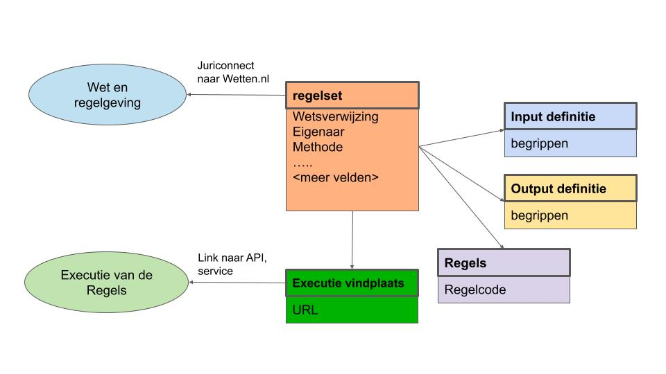

Deze specificatie is onderdeel van [[[RONL]]].

Waar we het in deze specificatie over <b>regels</b> hebben, bedoelen we óók <b>algoritmes</b>.

Doel van dit DCAT profiel is om beschrijvingen van regels te verzamelen in [[[RONL]]] die compatibel zijn met het DCAT-AP-DONL profiel voor [[[DONL]]].

Het volgende diagram geeft een overzicht van de basis functionaliteit van het beoogde DCAT-AP-RONL profiel en dient als overzicht van de te definieren beschrijvingen.

Het is gebaseerd op het [[[DCATAP_21]]] dat op zijn beurt gebaseerd is op de [[[DCAT_20]]] en de eerdere data.overheid.nl versie [[[DCATAPDONL_11]]].
