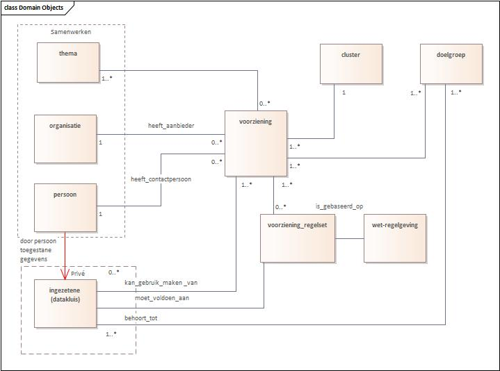

# Niet-normatieve deel

## Introductie

De Data Catalog vocabulaire (DCAT) is een standaard met als doel gepubliceerde gegevens en gegevensdiensten te beschrijven. Daardoor kunnen potentiële gebruikers beoordelen of de aangeboden gegevens voor hen relevant zijn en geschikt zijn voor hun gebruik. Dit selectieproces kan ook (gedeeltelijk) automatisch uitgevoerd worden. De geselecteerde bronnen kunnen dankzij de DCAT beschrijvingen efficiënt benaderd worden voor gebruik, of na detailonderzoek alsnog worden verworpen.

Daarnaast is het gebruikelijk om DCAT beschrijvingen op centrale systemen te verzamelen – bekend als "harvesting" – om overzichten te maken van alle aangeboden informatie in een bepaald domein, bijvoorbeeld een land of volgens andere criteria. Deze centrale DCAT registers maken het eenvoudig voor gebruikers om door een groot aanbod te zoeken naar nuttige gegevens en data services.

[[[DONL]]] is zo'n DCAT dataportaal van de Nederlandse overheid. Een voorbeeld van een ander portaal is die van de EU, namelijk [[[DATA_EU]]]. De EU leest de DCAT data van data.overheid.nl, daardoor zijn alle datasets van data.overheid.nl ook op data.europa.eu te vinden. Het gebruik van DCAT maakt dit soort cummulatieve verzamelingen mogelijk.

Het doel van het DCAT-AP-DONL profiel is om betere beschrijvingen te verzamelen in [[[DONL]]]. Het is ietwat uitgebreider dan de onderliggende [[[DCATAP_21]]] en [[[DCAT_20]]] profielen van het W3C, zodat het vinden van de juiste gegevens en gegevensdiensten nog makkelijker wordt.

Deze tekst is de introductie van het <a href="https://dataoverheid.github.io/dcat-ap-donl/" target="_blank">DCAT-AP-DONL 2.0</a> toepassingsprofiel .

Doel van dit DCAT profiel is om beschrijvingen van regels te verzamelen in [[[RONL]]] die compatibel zijn met het DCAT-AP-DONL profiel voor [[[DONL]]].

Dit toepassingsprofiel blijft in ontwikkeling. Commentaren, problemen, wensen e.d. kunnen als issue worden gemeld op de <a href="https://github.com/MinBZK/dcat-ap-ronl" target="_blank">Github pagina</a>.

## Algoritmeregister

### Nederlandse Algoritme Transparantie Standaard

De [[[ALGO-STAND]]] is een gestandaardiseerde manier om informatie te verzamelen over hoe de overheid algoritmische tools gebruikt. Met deze standaard registreert de Nederlandse Overheid algoritmes.

### Registratie

De overheid werkt steeds meer digitaal en gebruikt daarvoor steeds vaker algoritmes. Omdat digitalisering niet vanzelfsprekend goed gaat, werkt de overheid aan transparante en verantwoorde inzet van die algoritmes. Zodat de informatie over de algoritmes die de overheid gebruikt voor iedereen beschikbaar is: burgers, hun belangenbehartigers, de media en toezichthouders.

Het ministerie van Binnenlandse Zaken en Koninkrijksrelaties bouwt door aan het [[[ALGO]]] dat in december 2022 is gelanceerd.

Het [[[ALGO]]] is in ontwikkeling. De informatie verandert nog vaak. Nieuwe algoritmes worden toegevoegd en algoritmes worden geactualiseerd. Ook bouwt het ministerie van Binnenlandse Zaken en Koninkrijksrelaties steeds door aan het [[[ALGO]]]. Dit doet het team op een open manier.

Die open ontwikkeling betekent dat de inhoud door de tijd heen zal wijzigen, bijvoorbeeld:

- Er komen algoritmes bij of gaan algoritmes af
- De [[[ALGO-STAND]]] wordt gewijzigd en/of uitgebreid
- De reeds gepubliceerde beschrijving van algoritmes wordt gewijzigd en/of uitgebreid.

Een aantal overheidsorganisaties heeft op dit moment al algoritmes gepubliceerd. Het doel is om alle overheidsorganisaties met relevante algoritmes aangesloten te hebben. Uiteindelijk zal registratie ook wettelijk verplicht worden.

### Linked Open Data

Platform Linked Data Nederland (pldn) heeft obv een aantal best practices een praktische gids voor het publiceren van linked open data gemaakt. Een [9-stappen Roadmap](https://www.pldn.nl/wiki/BoekTNO/stappenplan). Er is een eerste poging gedaan om voor het Algoritmeregister die stappen te volgen. Tot nader order is de uitwerking daarvan in de Docusaurus van [[[RONL]]] gepubliceerd. Hier te vinden: https://regels.overheid.nl/docs/linked-data/Algoritmeregister

## Producten en diensten

### De Uniforme Productnamenlijst (UPL)

De [[[UPL]]] is een lijst met uniforme naamgeving voor de producten en diensten die de Nederlandse overheid biedt aan burgers en bedrijven. De nadruk daarbij ligt op producten en diensten waarbij er interactie met burgers en bedrijven is, zoals een aanvraag, melding of verplichting. Producten en diensten zoals onderhoud van de groenvoorziening of het wegennet zijn daarom niet in de UPL opgenomen. Iedere overheidsorganisatie is vrij om te bepalen wat haar producten en diensten zijn en welke naam zij daaraan geeft. Met name bij gemeenten zorgt dat voor een veelvoud aan producten en diensten, die eigenlijk in essentie hetzelfde zijn. Om de vindbaarheid en het hergebruik van productinformatie te verbeteren is de [[[UPL]]] (UPL) ontwikkeld. De lijst zorgt voor synergie in het heterogene productaanbod. De uniforme productnamen worden gebruikt om op een eenduidige manier de productinformatie van de overheid in voorzieningen te integreren, ongeacht bestuurslaag, naamgeving of granulariteit.

### De actuele en historische UPL

De actuele UPL vindt u hier: [[[Volledige-UPL]]].

Omdat het producten- en dienstenaanbod van de Nederlandse overheid regelmatig verandert, wordt de UPL vier keer per jaar bijgewerkt. Daarbij worden soms productnamen als ‘vervallen’ gemarkeerd. In sommige gevallen wordt de productnaam ‘opgevolgd’ door een nieuwe productnaam. Oude productnamen worden nooit weggegooid, maar blijven beschikbaar in de volledige historische productnamenlijst

## Voorzieningen

Voorzieningen, bij de overheid ook wel ‘regelingen’ genoemd, zijn alle vormen van ondersteuning aan inwoners die geboden worden door nationale of gemeentelijke overheden en charitatieve instellingen. Het vindbaar maken van voorzieningen en het vereenvoudigen van het doen van een aanvraag dragen bij aan het gebruik maken van deze voorzieningen.

### Harmonisator

In het eerste halfjaar 2022 is er een onderzoek uitgevoerd naar een Gemeentelijk Gegevenswoordenboek (GGw). Daarbij werd een grote verscheidenheid aan gegevensstructuren zichtbaar op tal van plaatsen in de informatievoorziening van de overheid. De behoefte aan "harmonisatie" van al deze modellen kwam duidelijk naar voren, waartoe het concept van de "Harmonisator" is ontwikkeld. Ook de Voorzieningen zoals bedoeld door [[[RONL]]] steunen op gegevensstructuren. Het eindverslag van dat verkennend onderzoek naar het GGw is [hier](./media/Rapport-GGw-1-0.pdf) te vinden.

### MVP

We maakten een kleine Voorzieningen-applicatie en API, op grond van voorbeelden van de gemeente Vught. Zo wordt de samenhang zichtbaar tussen de aanpak van de "Harmonisator" en de ontwikkeling van een generiek bruikbare en duurzame Voorzieningen-applicatie, die aansluit op de principes en het gedachtegoed van [[[RONL]]]. De kern hiervan is dat eerst de begrippen, relaties en definities helder zijn vastgelegd, als stevig fundament voor tal van toepassingen van gegevens- en informatiegebruik.

De objecttypen en hun samenhang bij Voorzieningen. Een voorziening doorloopt een levenscyclus langs de weg: behoefte, ontwikkeling, aanbieding/promotie, aanvraag, gebruik, bijstelling en afbouw.

- Gegevens van organisaties en personen (actoren) kunnen uit het generieke gegevensmodel 'Samenwerken' (coöperatie, afkorting 'co') worden gehaald.
- De categorisering en clustering van voorzieningen kan volgens standaard thema-indelingen, b.v. van [[[DONL]]] worden toegepast.

Het model is voorbereid op het toepassen van regels op de beschikbaarheid van een voorziening ([[[RONL]]]).

- De gegevens over de rechten op een voorziening worden in de entiteit 'Voorziening_Regelset' opgenomen.
- De entiteit 'Ingezetene' fungeert als (toekomstige) datakluis, mogelijk volgens principes van [NL Wallet](https://github.com/MinBZK/nl-wallet-demo-app).

### Demo

Er is een [demo-omgeving](https://www.ccoverheid.nl/demo/voorzieningen/menu/) voor de voorzieningen-toepassing. Deze Scriptcase- applicatie gebruikt een kopie van de database in de ontwikkelomgeving. De structuur en inhoud kan/zal - zonder aankondiging vooraf - geregeld worden gewijzigd. Je kan dus om te testen wel records aanmaken of wijzigen maar deze worden niet definitief bewaard. Met de API kan je dan al deze gegevens ophalen, toevoegen of wijzigen.
