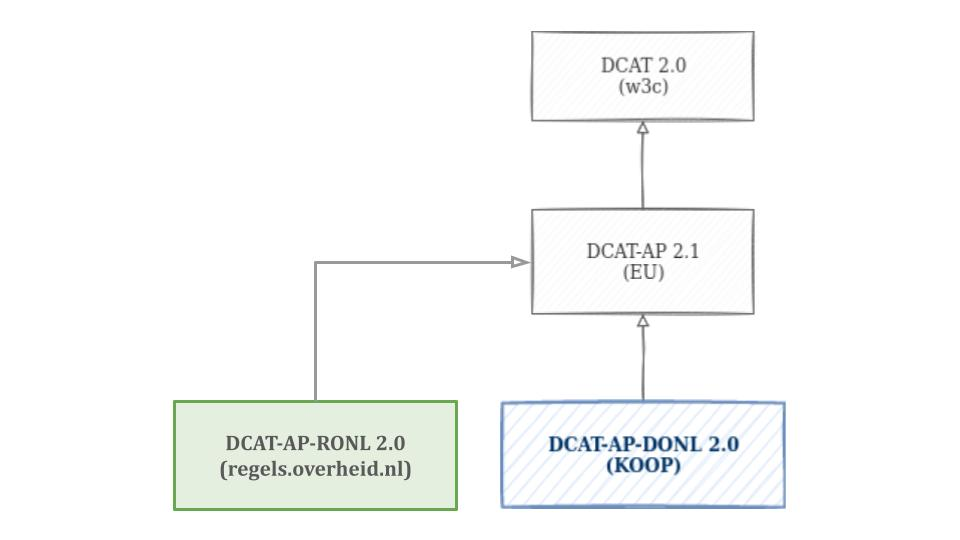

# Overzicht van het toepassingsprofiel

## DCAT 2.0

Het volgende diagram geeft een overzicht van de basis functionaliteit van DCAT 2 en dient als startblok voor het begrijpen van de construcie. LET OP, er zijn dus meer klassen, eigenschappen en relaties dan weergegeven. 

## Relatie andere profielen

In deze versie zijn de nieuwe mogelijkheden van het toepassingsprofiel van de EU ([[[DCATAP_21]]]) meegenomen,
samen met aanpassingen op basis van ervaring welke is opgedaan sinds [[[DCATAPDONL_11]]]. DCAT-AP-RONL is compatible met
bovenstaande standaarden, wat betekent dat een profiel dat voldoet aan DCAT-AP-RONL ook verwerkt kan worden binnen
[[[DCAT_20]]] en [[[DCATAP_21]]].

Om zoveel mogelijk scenario's te ondersteunen, verplichten de originele [[[DCAT_20]]] van het W3C en het
toepassingsprofiel van de EU ([[[DCATAP_21]]]) weinig. Omdat [[[RONL]]] alleen de Nederlandse overheid betreft kunnen we
meer informatie van gebruikers vragen. Daarmee worden regels beter vindbaar.
