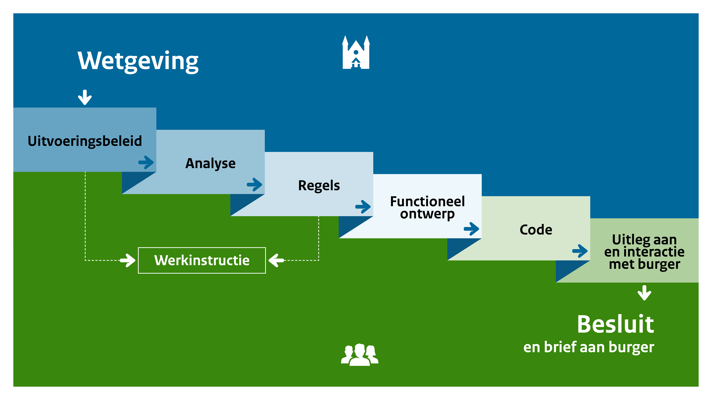

# Klassen

In dit hoofdstuk worden de klassen van het applicatieprofiel benoemd en beschreven.

## Introductie

Als de overheid besluiten neemt in individuele gevallen waarbij het gaat om grote aantallen en veel vergelijkbare repeterende taken, gaat dit vaak geautomatiseerd. Hiervoor moet de wet vertaald worden en moet bepaald worden hoe de wet wordt uitgevoerd. Na gesprekken met de professionals hebben we dit proces in de volgende stappen onderscheiden.

Deze procesplaat is een illustratie, geen voorschrift. Elke organisatie zal het proces op een eigen manier hebben ingericht. Dat blijft in stand. De procesplaat en de onderverdeling in [[[LM]]], is een manier om het gesprek te voeren.

## Aanpak

Verplichte velden voor [[[RONL]]] over de linkerkant van de flow zijn relaties met "wetgeving", maar er kunnen 3 extra relaties zijn:
- uitvoeringsbeleid (bron: PUC, eigen website organisatie)
- analyseren (zoals gepubliceerd in analysetools, wetsanalyse-editors, enz.)
- werkinstructies (gepubliceerd in PUC of online in "handboeken")

Voor de items aan de rechterkant van de stroom moeten we een "distributieklasse" aanbieden om te beschrijven:
- functionele ontwerpen / koppelingen naar functionele ontwerpen in een Github-register (documentatie)
- algoritmes / code / applicaties waar regels worden uitgevoerd, gepubliceerd in een Github-register (uitvoering)
- handmatige procedures; grotendeels intern gepubliceerd (procesbeschrijvingen)

Het is belangrijk om vast te stellen: wat wordt opgeslagen/beschreven als onderdeel van de "regelset" en waaraan kan worden gekoppeld.
- Hieruit volgt dat alle objecten aan de linkerkant van regels in de stroom moeten worden gekoppeld.
- Alle objecten aan de rechterkant kunnen deel uitmaken van de regelsetbeschrijving.

Elke regelset heeft een URI nodig die kan worden gebruikt om te linken in openbare communicatie/brieven.